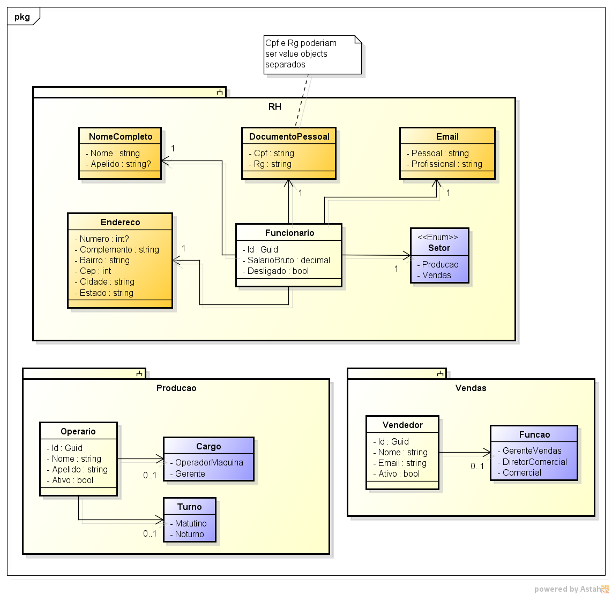
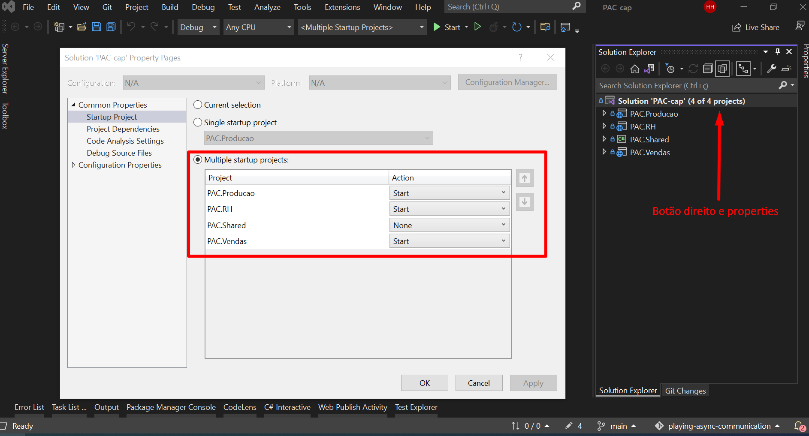

# "Brincando" com comunicação assíncrona de API's

Comunicação entre API's pode ser realizada de duas formas: **síncrona e assíncrona**. Na síncrona as chamadas são bloqueantes e em tempo real, do qual a resposta é resolvida de forma imediata. Em contrapartida, as chamadas assíncronas não são bloqueantes, onde todo processamento é realizado em segundo plano e respondido em tempo diferente da chamada realizada.

Uma das formas de performar comunicação entre API's usando comunicação assíncrona é a partir de *messages brokers*, que basicamente são servidores capazes de armazenar mensagens provenientes de componentes chamados producers, e que em algum momento no futuro os componentes chamados consumers irão consumir essas mensagens. Ambos componentes, *producers* e *consumers*, podem ser API's.


## Ideia implementada

Dado todo o contexto, a ideia da aplicação é realizar comunicação assíncrona entre todas as API's de um dado contexto de negócio, cuja sua modelagem estrutural está apresentada abaixo, em que temos três módulos: Rh, Produção e Vendas.



Em termos práticos cada módulo representa um subdomínio do negócio, ou seja, um bounded context (contexto limitado). Como a ideia é que cada contexto limitado seja independente e contenha seus próprios dados, as informações que são partilhadas entre eles são replicadas, garantindo que seja refletida entre os diferentes módulos por meio da chamada consistência eventual.

Em vista disso, uma instancia de Funcionario, Operario e Vendedor podem conter a mesma identidade, mas em contexto limitados diferentes são tratados com responsabilidades diferentes, mas caso possuam propriedades que representam a mesma informação precisam estar consistentes entre si.


## Esquema da Arquitetura Adotada

Foi adotado dois modelos de implementação para esta simples aplicação. Uma delas o código fonte está presente em */src-cap*, que utiliza como principais ferramentas [CAP](https://github.com/dotnetcore/CAP), que abstrai e facilita a utilização do message broker *RabbitMQ*, e os agendadores de tarefas de segundo plano para cada módulo: [Hangfire](https://github.com/HangfireIO/Hangfire), [Quartz.Net](https://github.com/quartznet/quartznet) e [FluentScheduler](https://github.com/fluentscheduler/FluentScheduler).


Já o outro modelo está presente em */src-masstransit* é bem similar ao de cima, com diferença que para uso do *Event Bus* (message broker) com o *RabbitMQ* é usado a ferramenta [MassTransit](https://github.com/MassTransit/MassTransit).


## Como executar?

Antes de tudo certifique-se de instalar o .Net 6, SQL Server, com SSMS preferencialmente e siga os seguintes passos para executar a aplicação usando o *Visual Studio*:

1. Rodar as migrations em cada um dos projetos (todas as API's) usando o seguinte comando no Package Manager Console:

    ```
    Update-Database -Context {nome_contexto} -StartupProject {nome_projeto_startup}
    ```

2. Criar uma instância da imagem hospedada no dockerhub do RabbitMQ para servir como message broker das API's por meio do seguinte comando:

    ```
    docker run -d --hostname rabbit-host --name rabbit-pac -p 15672:15672 -p 5672:5672 rabbitmq:3-management-alpine
    ```

3. Executar todas as API's simultaneamente, conforme é mostrado na imagem abaixo:

    


**OBS.:** Caso deseje utilizar corpo de dados já pré-montadas para enviar as requests para os endpoints da API de RH basta utilizar o arquivo *./data/rh-seed.json*.


## Referências

- [Comunicação em uma arquitetura de microsserviço](https://learn.microsoft.com/pt-br/dotnet/architecture/microservices/architect-microservice-container-applications/communication-in-microservice-architecture);
- [Identificar os limites de modelo de domínio de cada microsserviço](https://learn.microsoft.com/pt-br/dotnet/architecture/microservices/architect-microservice-container-applications/identify-microservice-domain-model-boundaries);
- [CAP](https://github.com/dotnetcore/CAP);
- [Hangfire](https://github.com/HangfireIO/Hangfire);
- [Quartz.Net](https://github.com/quartznet/quartznet);
- [FluentScheduler](https://github.com/fluentscheduler/FluentScheduler).